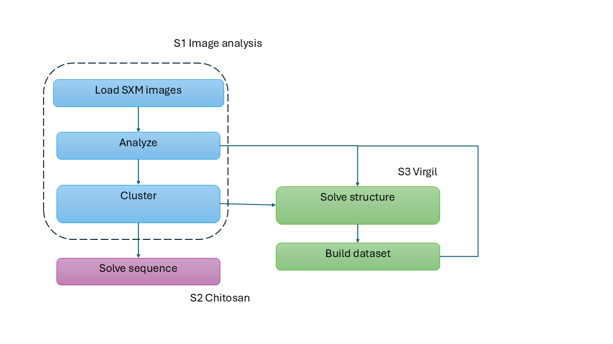

# Learning-and-tutorials

Tutorials and testing area for our projects.

## Description

It serves as a testing ground for experimenting with different libraries, algorithms, and techniques.

## Workflow and repository structure


#S1. Image analysis, basic load of SXM files, feature analysis and clustering.
#S2. Chitosan project solving image to binary sequence.
#S3. Virgil project solving image to ball and sticks.

## 1. Installation and Dependencies

Here you will find instructions for creating conda or python environments. Please note that conda is no longer supported at the Max Planck Institute, so please use free distributions (Miniconda) or Python virtual environments.

### Conda Environment (Legacy - Not Recommended)

⚠️ **Note**: Conda is no longer supported at Max Planck Institute. Use Python virtual environments instead.

For reference only:
```
conda create --name environment_name python=3.6 --file environment.yml
```
### Python Virtual Environment (Recommended)

#### Using venv (Built into Python 3.3+)

1. Create virtual environment with Python 3.6
```
python3.6 -m venv environment_name
```
2. Install packages from requirements file
```
pip install -r requirements.txt
```
### Getting Started

1. Clone this repository
2. Create and activate a Python virtual environment (see Installation section)
3. Install dependencies (requierements)
4. Navigate to the `tutorials/` directory
5. Start with the basic notebooks (ipynb)

